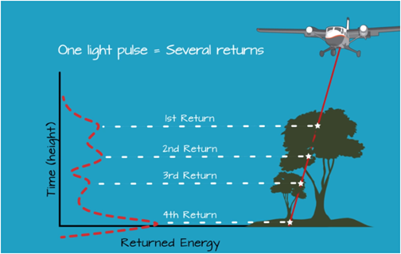
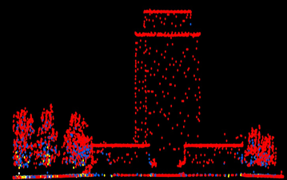
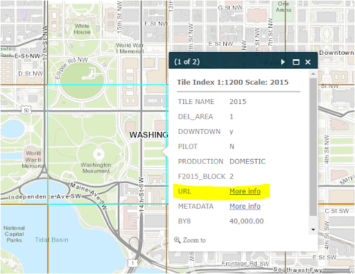
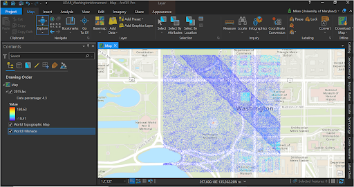
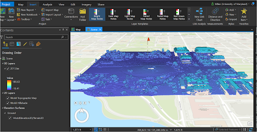
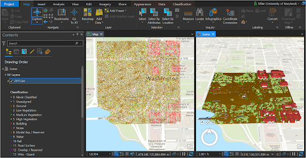
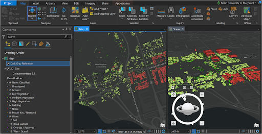
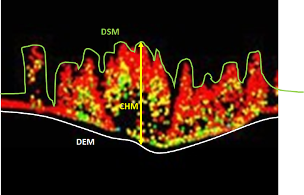
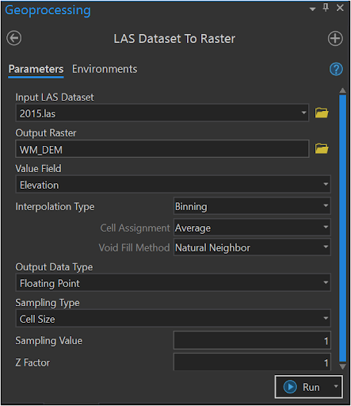

!!! Info

    *This tutorial is part of an educational series produced by members of the [Big Ten Academic Alliance Geospatial Information Network](https://geo.btaa.org).*

    :fontawesome-solid-user: Prepared by: Milan Budhathoki, GISP, Geospatial Librarian, GIS and Spatial Data Center, University of Maryland Libraries (mb17@umd.edu). 

    :material-creative-commons: These slides and the accompanying activities are licensed under a [Creative Commons Attribution 4.0 International](https://creativecommons.org/licenses/by/4.0/) license.

------------------------------

??? Note "Note for Instructors"

    This tutorial provides the basic concept of LiDAR dataset and point cloud processing in ArcGIS Pro. Depending upon spatial extent and the density of LiDAR point cloud, processing can be computationally tedious. The LiDAR dataset that will be used in this tutorial is about 730mb and may take some good compute resources to perform 3D rendering of the dataset.

------------------------------

## Introduction to LiDAR

Light Detection And Ranging (LiDAR) is an active remote sensing technique that uses pulsed laser energy to collect very high resolution and accurate elevation data across landscapes. LiDAR data can be collected from space, airborne sensors, stationary and mobile platforms.

<figure markdown>

<figcaption>Airborne and Stationary LiDAR Collection</figcaption>

</figure>

**LiDAR Pulse Return**

Depending upon the target object, the point cloud contains data points for scan hits and classified returns (Single Return- bare ground and Multiple Return-tree canopy).

<figure markdown>

<figcaption>LiDAR Pulse Return, Credit: NEON</figcaption>

</figure>

**LiDAR Point Cloud**

A LiDAR generated point cloud is a collection of points that stores 3D (XYZ) information along with other attributes (i.e classification, intensity, return number).

<figure markdown>

<figcaption>LiDAR Point Cloud Showing Building and Trees</figcaption>

</figure>

## Download LiDAR Point Cloud

1.  Go to [geo.btaa.org](geo.btaa.org).

2.  Under Explore Maps and Data , search for "DC LiDAR Point Cloud".

3.  Double click on the layer " District of Columbia: Classified Point Cloud LiDAR Tile Index" then go to the Visit Source link.

4.  Within the OCTO Tile Grid web application, zoom down to Washington Monument.

5.  Click on the grid box where the majority of Washington Monument is covered (TILE NAME 2015).

6.  Click on the "More info" hyperlinked text will download the LiDAR point cloud for the selected tile area.

<figure markdown>

<figcaption>Select the Washington Monument Grid</figcaption>

</figure>

## Loading LiDAR Data in ArcGIS Pro

**Loading point cloud**

1.  Start a new ArcGIS Pro project.

2.  Add the downloaded .las dataset (i.e, 2015.las) in the 2D map. By default the las point clouds are rendered and symbolized based on elevation.

<figure markdown>

<figcaption>.las File in a 2D Map</figcaption>

</figure>

**Setting up 2D and 3D map view**

1. Under the Insert menu bar, click to add New Local Scene then load the same .las dataset in 3D map window. The 3D map rendering gives a better view of the LiDAR point cloud with respect to the ground reality.

<figure markdown>

<figcaption>.las File in a 3D Map</figcaption>

</figure>

2. Now, let’s synchronize two map windows so the LiDAR data can be viewed side by side on both 2D and 3D scene.

3.	Under the View menu bar,  go to Link Views then choose 
Center and Scale. Now, dock the Scene window right to the Map
 window so that you can see both map frames as below:

<figure markdown>

<figcaption>Side by Side in ArcPro</figcaption>

</figure>

**Symbolize Point Cloud**

1. Under the Map window right click on 2015.las layer then go to **Symbology**. Drawing using Classification instead of Elevation.

2. Likewise, change the symbology for the 2015.ls layer in the Scene window. There are 20 plus classes that are represented by the point clouds. Your map windows may look like below:

<figure markdown>

<figcaption>Change the Symbology</figcaption>

</figure>

**Filter Point Cloud**

Let’s filter the point cloud dataset that only represents vegetation and building.

1. Go to the 2015.las layer **Properties** then in the **Layer Properties** window select **LAS Filter**. Under the **Classification Codes**, first clear all then check  “Low Vegetation”, “Medium Vegetation”, “High Vegetation” and “Building” then click **OK**.

2. Change the **Basemap** to Dark Gray Canvas so that the filtered features are stand out well.

<figure markdown>

<figcaption>Filtering for Trees and Buildings</figcaption>

</figure>

## Creating DEM and DSM from LiDAR

**DEM** (Digital Elevation Model): Bare ground (ground return)

**DSM** (Digital Surface Model): everything above ground/natural and built environment (all return)

!!! tip

    CHM (Canopy Height Model ): not an elevation but height or distance between the ground and top of the object (i.e, tree, building etc) 

<figure markdown>

<figcaption>DEM, DSM, and CHM</figcaption>

</figure>

**Creating DEM**

1. In ArcGIS Pro, go to the Map window, make sure that no filter is set up for the 2015.las layer (i.e, go to **Properties** then **LAS Filter** and make sure everything is checked!).

2. Right click on the 2015.las layer then go to **LAS Filters** then clear all but keep the **Ground**.

3. Open **LAS Dataset to Raster** geoprocessing tool then set up the parameters as shown in the image on the right and **Run** the tool.

<figure markdown>

<figcaption>LAS Dataset To Raster Tool</figcaption>

</figure>

New DEM which is named **WM_DEM** will be added to the map. Under the layer **Symbology** change the Color scheme to **Elevation #1** or any multipart color scheme to show elevation gradient. 

<figure markdown>

<figcaption>Washington Monument DEM</figcaption>

</figure>

**Creating DSM**

1. Under the Map window, make sure that no filter is set up for the 2015.las layer.

2. Right click on the 2015.las layer then go to **LAS Filters** then choose **All** Points.

3. Open **LAS Dataset to Raster** geoprocessing tool then set up the parameters as shown in the image on the right and Run the tool.

<figure markdown>

<figcaption>Set Cell Assignment to Maximum</figcaption>

</figure>

The new DSM which is named **WM_DSM** will be added to the map. Under the layer **Symbology** change the Color scheme to **Elevation #1** or any multipart color scheme to show elevation gradient. 

<figure markdown>

<figcaption>The Resulting DSM</figcaption>

</figure>