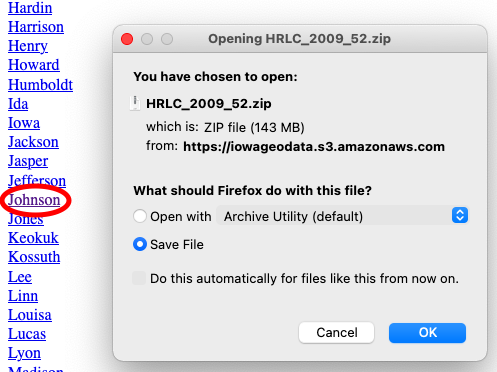
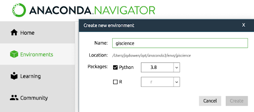
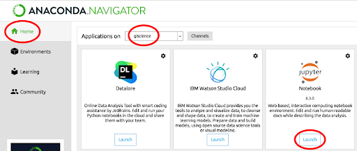
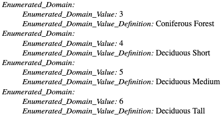
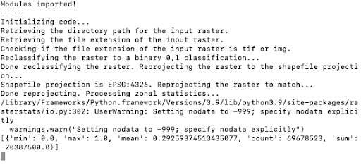
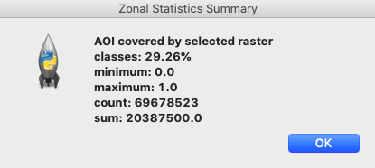
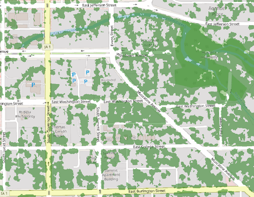

!!! Info

    *This tutorial is part of an educational series produced by members of the [Big Ten Academic Alliance Geospatial Information Network](https://geo.btaa.org).*

    :fontawesome-solid-user: Prepared by: Jay Bowen, Geographic Information Specialist, University of Iowa (jay-bowen@uiowa.edu). 

    :material-creative-commons: These slides and the accompanying activities are licensed under a [Creative Commons Attribution 4.0 International](https://creativecommons.org/licenses/by/4.0/) license.

------------------------------

??? Note "Note for Instructors"

    This tutorial is intended for both MacOS and Windows GIS users with a cursory understanding of how to use python scripts, regardless of whether they are graduate, undergraduate, or faculty/staff users. These users may wish to create easy to use free-standing analytical tools that they can run without desktop GIS software, but are unsure of how to write a script to create GUI-driven tools. 

    This tutorial is meant to show users how to create an open-source GUI tool that accepts a raster file and a polygon shapefile as inputs and calculates the coverage of a given range of raster classes within the shapefile polygon. 

    The tutorial was designed for self-guided independent learning.

------------------------------


## Introduction

You may need to know the percentage of a specific area devoted to a type of land cover, also known as a zonal statistic. For example,  you may work for a city government office charged with researching climate change mitigation strategies. You know that more trees are associated with a reduction of extreme heat. You might wish to calculate how much of the land in your city is covered by tree canopy to compare this to a desired benchmark.

Usually, people calculate this by turning to the ArcGIS tool suite, or by running ArcPy in the ArcGIS Python Window. However, ArcGIS can be expensive and out of reach for many users. Moreover, apart from ArcGIS Online, the software depends on Windows, limiting its use. This tutorial will show users how to derive zonal statistics without ArcGIS tools or ArcPy scripting. 

In this example, you will begin with a land cover raster for the State of Iowa and a shapefile of Iowa City. The tutorial will walk through the installation and use of open-source Python packages in Jupyter Notebook and Anaconda-Navigator to calculate the percentage of Iowa City covered by tree canopy (represented by classes 3, 4, 5, and 6 in the raster data). 

??? Note "Note"

    **This code is not meant to be run in IDLE or the ArcGIS Python Window.**

## Learning Objectives

Students will:

1.  Use basic Terminal or Command Prompt scripts

2.  Learn how to install and import Python packages, such as tkinter, gdal, and rasterstats.

3.  Implement these packages with Python scripting using Jupyter Notebook in Anaconda-Navigator to calculate zonal statistics for a range of raster classes within an area of interest defined by a shapefile polygon (% of Iowa City covered by tree canopy).

## Don’t have time to download and install Anaconda-Navigator and Jupyter Notebook?

-   That's fine! You can run the entire tutorial in [this Binder site for Jupyter Notebook](https://notebooks.gesis.org/binder/v2/gh/ui-libraries/Zonal_Statistics_Tool_JupyterNotebook/HEAD). Just follow the embedded link and click on the "ZonalStatistics_withWidgets.ipynb" file.

-   If you decide to use the Binder tutorial, you may close out of this presentation.

??? Note "Note" 
    
    The Binder tutorial replaces the tkinter GUI with ipywidgets in order to handle user inputs within Binder over the web.

## Prepare Directory Structure

-   Open Terminal on Mac, or Command Prompt on Windows.

-   If you are using Windows Command Prompt on an institutional or office PC and it defaults to a drive other than the C drive and your user name (such as H:\>), input the following to point it to the correct place on the C drive (replace "johnsmith" with your own user name) and press enter:

```shell 
cd /d C:\Users\johnsmith
```

-   In Mac Terminal,  input the following and leave Terminal open:

```bash
mkdir Desktop/zonal_statistics && mkdir Desktop/zonal_statistics/data && curl https://raw.githubusercontent.com/jebowe3/zonalstats_jupyternotebook/main/ZonalStatistics.ipynb -L -o Desktop/zonal_statistics/ZonalStatistics.ipynb
```

-   In Windows Command Prompt, type the following and leave Command Prompt open:

```shell
mkdir Desktop\zonal_statistics && mkdir Desktop\zonal_statistics\data && curl https://raw.githubusercontent.com/jebowe3/zonalstats_jupyternotebook/main/ZonalStatistics.ipynb -L -o Desktop/zonal_statistics/ZonalStatistics.ipynb
```

-   This will create a folder on your desktop called "zonal_statistics" and another folder called "data" within the desktop "zonal_statistics" folder. It will also download the Jupyter Notebook .ipynb file with all of the python code.

<figure markdown>

<figcaption>Directory Structure</figcaption>

</figure>

## Gather and Prepare Data

-   Open the [BTAA Geoportal](https://geo.btaa.org/)

-   In the search bar, type "High Resolution Land Cover of Iowa in 2009 Counties: Iowa"

-   Choose and open the [result](https://geo.btaa.org/catalog/2265abfa-0513-4a83-87a7-38304384d736) and click the "Original Raster Dataset" button at the right side of the page

<figure markdown>

<figcaption>Original Raster Dataset</figcaption>

</figure>

-   From the list of counties, choose "Johnson"

-   Download, unzip, and save the folder inside the "Desktop/zonal_statistics/data" folder you just created

<figure markdown>

<figcaption>Download, Unzip, & Save</figcaption>

</figure>

-   Return to Terminal or Command Prompt and type the following code to download the Iowa City boundary files to your data folder:

```bash
curl https://github.com/jebowe3/zonalstats_jupyternotebook/raw/main/IowaCity_Shapefile.zip -L -o Desktop/zonal_statistics/data/Iowa_City_Poly.zip
```

-   Unzip this folder so that you have access to the shapefile within it

<figure markdown>

<figcaption>Unzip Iowa_City_Poly.zip</figcaption>

</figure>

## Download Necessary Programs

-   Download the latest edition of Anaconda-Navigator

-   [MacOS](https://www.anaconda.com/products/individual#macos)

-   [Windows](https://www.anaconda.com/products/individual#windows)

-   Open Anaconda-Navigator and select "Environments"

-   Click the "Create" button and name the new environment "giscience"

-   Create this environment with a Python package

??? Note
     
     We tested this tutorial with Python 3.8 and Python 3.7.16. Newer Python packages may not work with the code presented here.

<figure markdown>

<figcaption>Create an Environment in Anaconda</figcaption>

</figure>

-   In Anaconda, return to "Home"

-   Make sure the header reads "Applications on giscience"

-   Find Jupyter Notebook and click "Install"

-   After installation, click "Launch"

<figure markdown>

<figcaption>Launch Jupyter Notebook</figcaption>

</figure>

-   Inside Jupyter Notebook, navigate to "Desktop/zonal_statistics"

-   Click on the "ZonalStatistics.ipynb" file

<figure markdown>

<figcaption>Open ZonalStatistics.ipynb</figcaption>

</figure>

-   You have already downloaded the sample data, so skip the first cell

-   Run the cell under "Install Required Packages" to ensure that you have all of the necessary Python modules to run the code

<figure markdown>

<figcaption>Install Required Packages</figcaption>

</figure>

-   Now, test the modules by running the cell under "Import Modules"

## Run the Python Code

-   Now, follow through the steps in the Jupyter Notebook file, reading the descriptions and commented out code along the way for a better sense of what is happening

-   A GUI input form will open, but it may be hidden behind your browser window. Follow the instructions, providing the City.shp and HRLC_2009_52 files you downloaded for the two browseable file inputs

-   Here, City.shp is the Iowa City boundary, HRLC_2009_52 is the land cover of Johnson County. The land cover classes corresponding to tree canopy are 3 - 6, inclusive...

<figure markdown>

<figcaption>GUI Input Form</figcaption>

</figure>

## Explanation of the Code

-   If you look inside the metadata xml file that comes with the land cover raster, you will see which classes correspond to which land covers. In this exercise, we are isolating tree coverage (values 3 to 6).

<figure markdown>

<figcaption>Land Cover Metadata</figcaption>

</figure>

-   Now, while we wait for the code to run, let's take a more detailed look at what it is doing...

```python
import os
import tkinter as tk
from tkinter.filedialog import askdirectory
from tkinter.filedialog import askopenfilename
import tkinter.messagebox
from osgeo import gdal
from osgeo import ogr, osr
import numpy as np
from numpy import zeros
from numpy import logical_and
import rasterio as rio
from rasterstats import zonal_stats
```

The script above imports the packages that Python will need to make the tool run. The os module allows the script to interact with the operating system. Tkinter is a GUI package that allows you to build a dialog box / input form for the tool. The osgeo package offers open source libraries, like gdal and ogr, for working with geospatial data. The numpy library allows for mathematical computations, while rasterio and rasterstats allow you easy manipulation and analysis of raster data.

Also, you should notice how these lines of code interact with the code below to link the defined inputs to the GUI widgets. Notice that you have some control over the placement and appearance of these elements within the GUI. You can also edit the text.

```python
##  GUI Widgets
##  G-1. Shapefile Selection
##  1-Label
label_1 = tk.Label(self, text="Select the shapefile for your area of interest")
label_1.grid(row=0, column=0, columnspan=2, padx=5, pady=5, sticky="W")

##  1-Entry Box
var_1 = tk.StringVar()
entry_1 = tk.Entry(self, textvariable=var_1)
entry_1.grid(row=0, column=2, padx=5, pady=5, ipadx=100, sticky="W")

##  1-Button
button_1 = tk.Button(self, text="Browse", command=BrowseFile_1)
button_1.grid(row=0, column=3, padx=5, pady=5, sticky="E")
```

Let’s look at what happens after you click “OK”. The code below defines the form inputs with some more memorable names. It also ensures that the raster class inputs are parsed as numeric values, rather than as strings.

```python
##  Set input variables
input_zone_polygon = var_1.get()
input_value_raster = var_2.get()
low_class_str = var_3.get()
high_class_str = var_4.get()

## Convert numeric strings to integers
low_class_int = int(low_class_str)
high_class_int = int(high_class_str)
```

A few lines below, you will see some code that defines the path to the raster file. Beneath this, is some code that isolates the file extension. Following this is a conditional test to isolate and define the driver, which we can use to create the new reclassified raster.

```python
## Get the directory path of the input raster
ras_dir_path = os.path.dirname(input_value_raster)


## Get the file extension of the raster file
file_ext = os.path.splitext(input_value_raster)[1]

if file_ext == '.tif':
     drive = 'GTiff'
elif file_ext == '.img':
     drive = 'HFA'

#Define the gdal driver with the drive variable from the conditional test
driver = gdal.GetDriverByName(drive)
```

The code below takes the input raster file and reassigns a binary classification based on the range the user defines in the dialog box. If the classes are higher or lower than the input range, these will be redefined as 0. If the classes match the desired range, they will be redefined as 1. Then, the code creates a new file called “raster2” in the same directory as the input raster and sets the projection.

```python
file = gdal.Open(input_value_raster)
band = file.GetRasterBand(1)


# reclassification
classification_values = [0,low_class_int,high_class_int + 1]
classification_output_values = [0,1,0]

block_sizes = band.GetBlockSize()
x_block_size = block_sizes[0]
y_block_size = block_sizes[1]

xsize = band.XSize
ysize = band.YSize

max_value = band.GetMaximum()
min_value = band.GetMinimum()

if max_value == None or min_value == None:
     stats = band.GetStatistics(0, 1)
     max_value = stats[1]
     min_value = stats[0]

# create new file
file2 = driver.Create( ras_dir_path + '/raster2' + file_ext, xsize , ysize , 1, gdal.GDT_Byte)

# spatial ref system
file2.SetGeoTransform(file.GetGeoTransform())
file2.SetProjection(file.GetProjection())
```

The following block of code assigns the newly defined classes to each pixel in the “raster2” file by reading the input pixel values as an array and assigning new values based on a translation of classification breaks from the input “classification_values” [0, 3, 7] to the output “classification_output_values” [0, 1, 0]. Thus, any value less than 3 or greater than or equal to 7 is reclassified as 0, while anything greater than or equal to 3 and less than 7 is reclassified as 1.

```python 
print('Reassigning raster values...please wait...')
for i in range(0, ysize, y_block_size):
     if i + y_block_size < ysize:
          rows = y_block_size
     else:
          rows = ysize - i
     for j in range(0, xsize, x_block_size):
          if j + x_block_size < xsize:
               cols = x_block_size
          else:
               cols = xsize - j

          data = band.ReadAsArray(j, i, cols, rows)
          r = zeros((rows, cols), np.uint8)

          for k in range(len(classification_values) - 1):
               if classification_values[k] <= max_value and (classification_values[k + 1] > min_value ):
                    r = r + classification_output_values[k] * logical_and(data >= classification_values[k], data < classification_values[k + 1])
          if classification_values[k + 1] < max_value:
               r = r + classification_output_values[k+1] * (data >= classification_values[k + 1])

          file2.GetRasterBand(1).WriteArray(r,j,i)

file2 = None 
```

Next, the script identifies the projection of the input shapefile and reprojects the “raster2” file to match the projection of the shapefile. The reprojected raster is then saved as “raster2_reproject” in the same directory as the input raster. This process is important because both the polygon and raster need to be in matching projections for the computation of zonal statistics.

```python
# Get the EPSG code of the input shapefile
shp_driver = ogr.GetDriverByName('ESRI Shapefile')
dataset = shp_driver.Open(input_zone_polygon)
layer = dataset.GetLayer()
spatialRef = layer.GetSpatialRef()
shp_epsg = spatialRef.GetAttrValue("GEOGCS|AUTHORITY", 1)

# Reproject the raster
input_raster = gdal.Open(ras_dir_path + '/raster2' + file_ext)
output_raster = ras_dir_path + '/raster2_reproject' + file_ext

warp = gdal.Warp(output_raster,input_raster,dstSRS='EPSG:'+str(shp_epsg))
warp = None
```

The following lines perform the zonal stats analysis and display the percent coverage of the input polygon by the selected raster classes, along with some supporting statistics in a message window that appears on the user’s screen after the analysis is complete.

```python
zs = zonal_stats(input_zone_polygon,output_raster,stats=['min', 'max', 'mean', 'count', 'sum'])

## Hide the tkinter root box
root = tk.Tk()
root.withdraw()

## Define each zonal stat
min = [x['min'] for x in zs]
max = [x['max'] for x in zs]
mean = [x['mean'] for x in zs]
count = [x['count'] for x in zs]
sum = [x['sum'] for x in zs]

## Build the messagebox content
lines = ["AOI covered by selected raster classes: " + str(round(mean[0]*100,2))+"%", "minimum: " + str(min[0]), "maximum: " + str(max[0]), "count: " + str(count[0]), "sum: " + str(sum[0])]

## Display the messagebox content in separate lines
tk.messagebox.showinfo("Zonal Statistics Summary", "\n".join(lines))
```

<figure markdown>

<figcaption>Progress Notes</figcaption>

</figure>

After processing finishes, it will produce a text box providing information about how much of the polygon is covered by the selected range of classes.

<figure markdown>

<figcaption>Zonal Statistics Summary</figcaption>

</figure>

The tool will also output a reprojected raster file (raster2_reproject) that isolates your selected raster class range.

In the screenshot, you can see the results, isolating the tree canopy classes from the input raster.

<figure markdown>

<figcaption>Iowa City Tree Canopy Raster</figcaption>

</figure>
