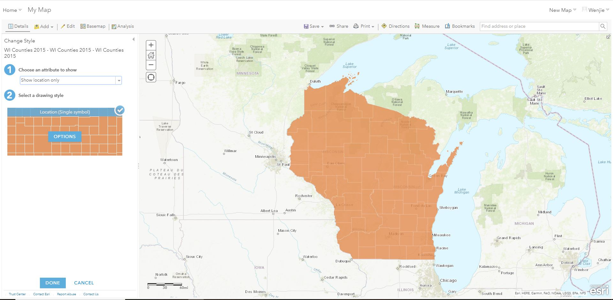
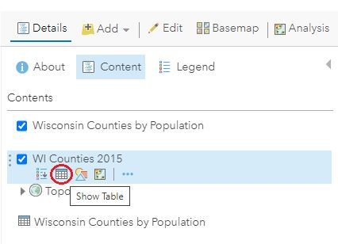
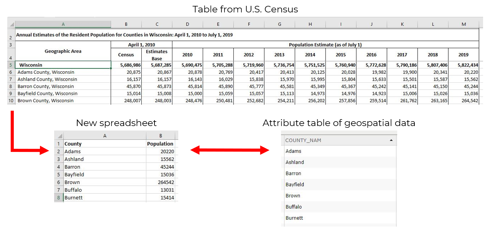
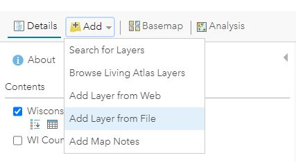
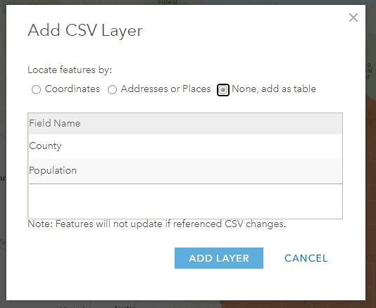
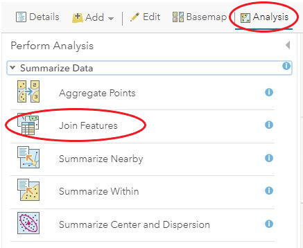
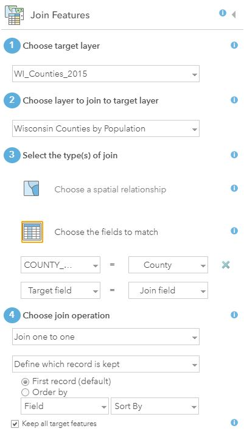
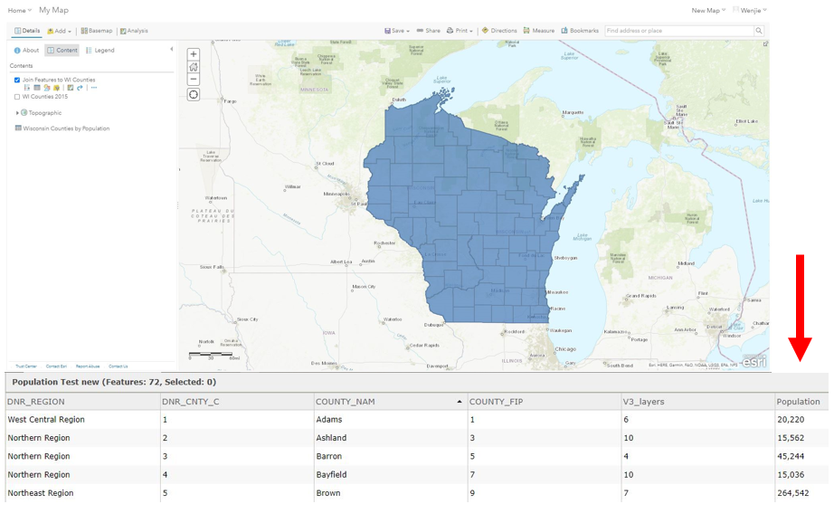
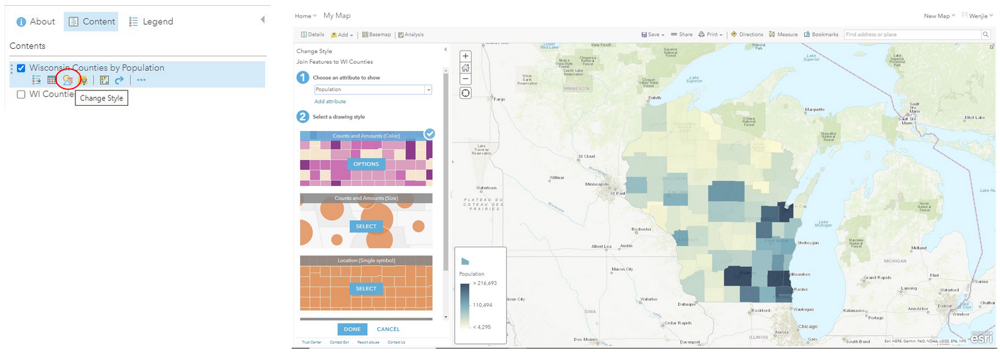

# Linking Tabular Data to Geospatial Data

## Contents
- [Introduction](#introduction)
- [Download Data](#download-data)
- [Prepare Data](#prepare-data)
- [Data Process](#data-process)
- [Exercise](#exercise)
- [Wrapping Up](#wrapping-up)

## Introduction

This tutorial gives an example to help students understand GIS technology allows people to connect data with geography. GIS can relate unrelated information by using location as the key index variable. Sometimes people don’t fully understand their data until they see how it relates to other things in a geographic context. And GIS can help people understand what belongs where.

Through this tutorial, student can get familiar with how to link tabular data to geospatial data by using ArcGIS Online. Instructors can add more exercises based on students’ need.

## Download Data

Geospatial Data is the data about a object that has a geographic component.

The [Big Ten Academic Alliance Geoportal](https://geo.btaa.org) connects users to digital geospatial resources, including GIS datasets, web services, and digitized historical maps from multiple data clearinghouses and library catalogs. The site is solely a search tool and does not host any data.

Visit the Project [Documentation](https://sites.google.com/umn.edu/btaa-gdp/about/documentation?authuser=0) page to find out more about our project's history, committees, working groups, conference presentations, and journal articles.

The following steps show how to find geospatial data from BTAA geoportal and tabular data from U.S. Census:

1. Search the keywords "county boundary of Wisconsin" through BTAA geoportal

2. Open the first result "County Boundaries, Wisconsin 2015"

3. Click the "Original Shapefile" button to download the data. Save as "WI_Counties_2015.zip"

This polygon feature class represents boundaries of the 72 counties in Wisconsin. The data is derived from 1:24,000-scale sources. This feature class was last updated in June 2015.

\
**Figure 01**. Polygon Feature Class for Wisconsin County Boundaries

4. Open U.S. Census website (<https://www.census.gov/en.html>) and search the keywords "wisconsin counties by population"

5. Open the first result "County Population Totals: 2010-2019" and click Wisconsin to download the table.

\
**Figure 02**. Annual Estimates of the Resident Population for Counties in Wisconsin: April 1, 2010 to July 1, 2019 (CO-EST2019-ANNRES-55), U.S. Census Bureau, Population Division, March 2020

## Prepare Data

1. Log into ArcGIS Online and create Web Map

\
**Figure 03**. Adding a Layer in ArcGIS Online

2. Add WI_Counties_2015.zip as a new layer from File

\
**Figure 04**. Choosing a File in ArcGIS Online

3. Choose an attribute to show. Here we use “show location only”

\
**Figure 05**. Choosing an Attribute to Show in ArcGIS Online

4. Click “show table” button to open attribute table and get to know what information was included in the geospatial dataset.

\
**Figure 06**. Show Table in ArcGIS Online

\
**Figure 07**. Attribute Table in ArcGIS Online

5. Create a new excel file and name it as "Wisconsin Counties by Population.csv". Copy and paste the county name column and population in 2019 column from U.S. Census spreadsheet into this new excel file. We need to use county name as the common field to link those two tables. Therefore, the name of counties in both table should be the same.\
Notice: paste the values only and revise the name of counties by using replace tool.

\
**Figure 08**. Shared Attribute Between Two Tables

6. Add the “Wisconsin Counties by Population.csv” as a new layer and choose “None, add as table”

\
**Figure 09**. Add Layer from File

\
**Figure 10**. Add CSV

## Data Process

The following steps show how to link tabular data to the geospatial data: 

1. Click Analysis and choose Join Features

\
**Figure 11**. Joining Features

2. Choose WI_Counties_2015 as the “Target Layer” and Wisconsin Counties by Population as the “Layer to Join to the Target Layer”.

3. Choose the “COUNTY_Nam” and “County” as the fields to match.

4. Choose a one-to-one join operation and name the result layer as Wisconsin Counties by Population.

\
**Figure 12**. Join Features Input Form

5. Click the Run Analysis button, and a new layer based on population will be shown.

\
**Figure 13**. Join Output

6. Symbolize the Wisconsin Counties by Population layer by clicking “change style” button

\
**Figure 14**. Change Layer Style

7. Choose the appropriate style to clearly show the population

\
**Figure 15**. Reset Choropleth Symbology

8. Share or Print the Wisconsin Counties by Population map

9. For copyright information, refer to the copyright tutorial

\
**Figure 16**. Share or Print

## Exercise

1. What's the advantage of mapping tabular data?

2. Choose different basemap and use different symbol to create different thematic map.

3. Download a shapefile data related to students’ research field and link their tabular data to it.

## Wrapping Up

This tutorial is part of an educational series produced by members of the [Big Ten Academic Alliance Geoportal](https://geo.btaa.org). The BTAA Geoportal connects users to digital geospatial resources, including GIS datasets, web services, and digitized historical maps from multiple data clearinghouses and library catalogs. The site is solely a search tool and does not host any data.\
To access additional tutorials in this series that cover various other topics, visit: <https://sites.google.com/umn.edu/btaa-gdp/tutorials>.

**License statement:**\
Except where otherwise noted, content in this tutorial is licensed under a [Creative Commons Attribution 4.0 International license](https://creativecommons.org/licenses/by/4.0/).

**Providing attribution for this work:**\
"Linking Tabular Data to Geospatial Data" by Wenjie Wang is licensed under a [Creative Commons Attribution 4.0 International license](https://creativecommons.org/licenses/by/4.0/).