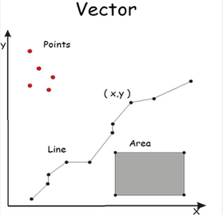
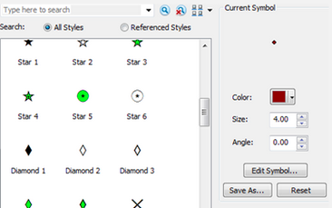
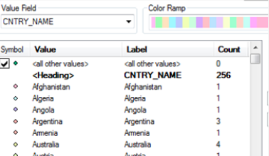
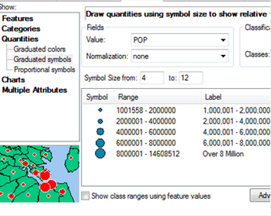

# Types of Geospatial Information

## Contents
- [Introduction](#introduction)
- [Geospatial Information Types](#geospatial-information-types)
  - [Vector Data](#vector-data)
  - [Raster Data](#raster-data)
  - [Vector vs. Raster](#vector-vs-raster)
  - [Tabular Data](#tabular-data)
  - [Scanned Maps](#scanned-maps)
  - [Web Services - GIS](#web-services-gis)
- [How to Find These Data in the BTAA Geoportal](#how-to-find-these-data-in-the-btaa-geoportal)
  - [Search by Resource Class](#search-by-resource-class)
  - [Related Resources](#related-resources)
  - [Exercise](#exercise)
- [Wrapping Up](#wrapping-up)

## Introduction

* There are many types of data that can be brought into GIS.

* The “type” introduced in this tutorial refers to the different data models that can usually be discovered from a geodata portal or other data portal sites. Or, the data models that GIS professionals usually use to collect and share information.

* It doesn’t refer to the topic, content, or the purpose of the information, the information source, or any other aspects.

* BTAA Geoportal Project Glossary of Terms
https://sites.google.com/umn.edu/btaa-gdp/about/project-documents/glossary

## Geospatial Information Types

* GIS data are usually stored in one of the following data models
  * Vector
  * Raster
  * Tabular

* Geospatial information can be found from scanned maps

* GIS data can be hosted online using web services

<table>
  <tr>
    <td>Vector</td>
    <td rowspan="4">Web Services</td>
  </tr>
  <tr>
    <td>Raster</td>
  </tr>
  <tr>
    <td>Tabular</td>
  </tr>
  <tr>
    <td>Scanned Map</td>
  </tr>
</table>

### Vector Data

<table>
  <tr>
    <th style="color:red;">Vector</th>
    <td rowspan="4">Web Services</td>
  </tr>
  <tr>
    <td>Raster</td>
  </tr>
  <tr>
    <td>Tabular</td>
  </tr>
  <tr>
    <td>Scanned Map</td>
  </tr>
</table>

* Vector data are comprised of vertices and lines (or arcs), represented explicitly in the form of XY coordinates.

* The 3 basic geometry types for vector data are:

  * Points - XY coordinates

    * Example: cities, schools, incident locations

  * Lines - connecting the points in a set order

    * Example: roads, streams

  * Polygons - a set of points in a particular order and close it (the 1st and last point are the same)

    * Example: a state, county, or census block

* Most GIS applications do not allow mixed geometry type
In a single layer

  
**Figure 01**. Vector Data Types *Used by permission of Paul Bolstad, GIS Fundamentals

* Each vector feature has attribute data that describe it.

  
**Figure 02**. Attribute Data

* Vector data are usually saved as a shapefile or a feature class in a geodatabase (In Arc/Info (1980-1999), it can also be saved in coverage format).

* Vector symbology:

  
**Figure 03**. Single Symbol

  
**Figure 04**. Categorical Symbol

  
**Figure 05**. Quantitative Symbol

### Raster Data

<table>
  <tr>
    <td>Vector</td>
    <td rowspan="4">Web Services</td>
  </tr>
  <tr>
    <th style="color:red;">Raster</th>
  </tr>
  <tr>
    <td>Tabular</td>
  </tr>
  <tr>
    <td>Scanned Map</td>
  </tr>
</table>

* Raster data is made up of pixels with each pixel has its own 
Value.

* Raster data is usually used to represent surfaces.

* Raster data model is commonly used for digital elevation models (DEM), aerial and satellite imagery, and land use land cover maps.

* Raster data resolution: cell dimension, or the size of pixels.

* Raster images can consume a large amount of storage space.

  
**Figure 06**. Raster Data Types *Used by permission of Paul Bolstad, GIS Fundamentals

* Two types of raster data: **continuous** and **discrete**

  * **Discrete** rasters have distinct themes or categories. Each class can be discretely defined, usually ba integer values. Example, land cover/use map.

  * **Continuous** rasters are grid cells with gradual changing data such as elevation and temperature.

  
**Figure 07**. Continuous and Categorical Data *Used by permission of Paul Bolstad, GIS Fundamentals

* Raster data are usually saved in the format of raster dataset, GeoTIFF, or many other formats.

### Vector vs. Raster

|   |**Vector**|**Raster**|
|---|---|---|
|**Positional Precision**|Can be precise|Defined by cell size|
|**Attribute Precision**|Poor for continuous data|Good for continuous data|
|**Output Quality**|Very good, map like|Fair to poor, depending on resolution|
|**Data Structure**|Often complex|Often quite simple|
|**Storage Requirement**|Relatively small|Often quite large|
|**Spatial Analysis**|Good topology relationship|Good for modeling|

### Tabular Data

### Scanned Maps

### Web Services - GIS

## How to Find These Data in the BTAA Geoportal

### Search by Resource Class

### Related Resources

### Exercise

## Wrapping Up
